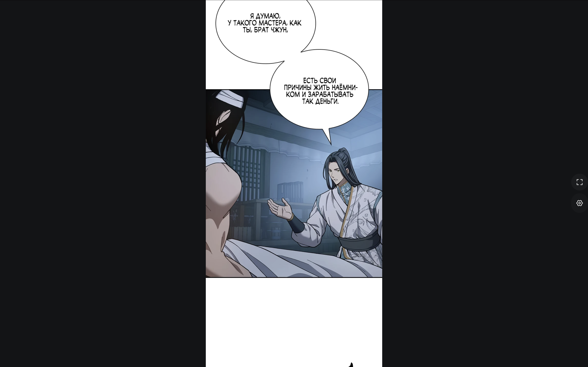
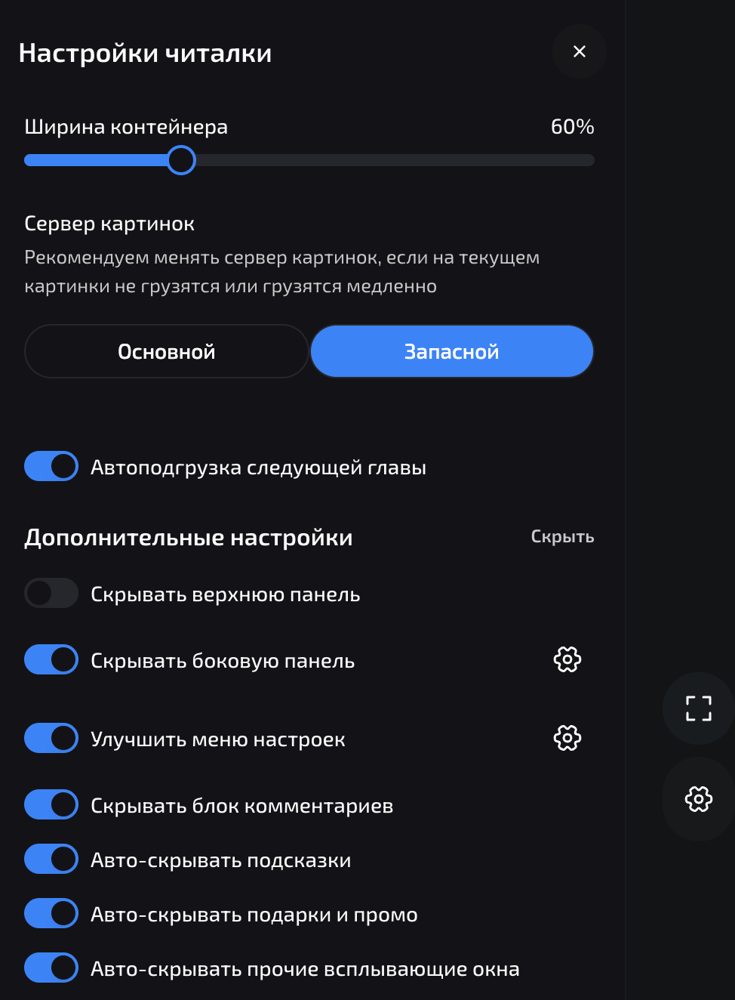
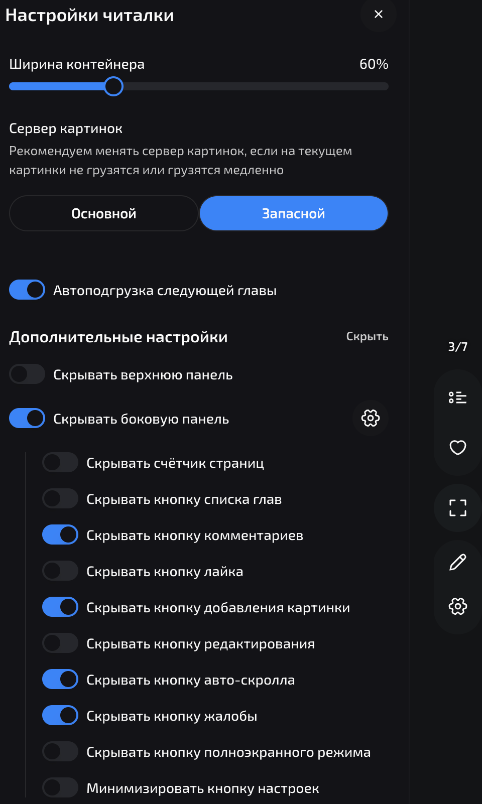
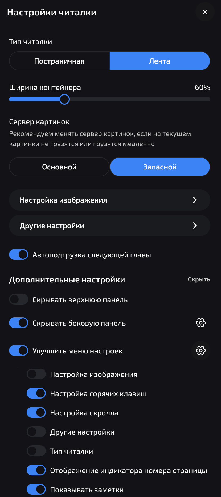

<p align="center">
  
</p>

<h1 align="center">ReManga Plus</h1>

<p align="center">
  Chrome-расширение, которое убирает визуальный шум из читалки <a href="https://remanga.org">ReManga</a> и даёт полный контроль над интерфейсом.
</p>

<p align="center">
  
  
  
</p>

> **💡 Совет:** для лучшего опыта используйте вместе с [uBlock Origin Lite](https://chromewebstore.google.com/detail/ublock-origin-lite/ddkjiahejlhfcafbddmgiahcphecmpfh?hl=en) — он уберёт рекламу, а ReManga Plus сделает интерфейс читалки идеально чистым.

---

## Что делает

ReManga Plus встраивается в страницу читалки и добавляет собственную панель **«Дополнительные настройки»** прямо в родной drawer. Все изменения применяются мгновенно и сохраняются между сессиями через `chrome.storage.sync`.

---

## Скриншоты

<table>
  <tr>
    <td align="center"><b>Настройки расширения в drawer</b></td>
    <td align="center"><b>Гранулярное управление кнопками</b></td>
  </tr>
  <tr>
    <td></td>
    <td></td>
  </tr>
  <tr>
    <td align="center"><b>Улучшенное меню настроек</b></td>
    <td align="center"><b>Чистый режим чтения</b></td>
  </tr>
  <tr>
    <td></td>
    <td></td>
  </tr>
</table>

---

## Возможности

### Управление интерфейсом

| Функция | Описание |
|---------|----------|
| **Полноэкранный режим** | Кнопка fullscreen прямо на правой панели читалки |
| **Скрытие header** | Убирает верхнюю навигационную панель при чтении |
| **Скрытие правой панели** | Гибкое скрытие — каждая кнопка управляется отдельным переключателем |
| **Скрытие счётчика страниц** | Убирает индикатор текущей страницы |
| **Скрытие комментариев** | Убирает блок комментариев под главой |
| **Premium Free** | Подменяет locked/premium-экран native-like reader-слоем, повторяет настройки ReManga и в режиме `Лента` может продолжать paid/missing главы parser-backed chapter stream-ом |

### Кнопки правой панели

Отдельный переключатель для каждой кнопки:

- Список глав
- Комментарии
- Лайк
- Добавить изображение
- Редактирование
- Автоскролл
- Жалоба
- Кнопка полноэкранного режима

### Улучшение меню настроек

Пресет **«Улучшить меню настроек»** позволяет выборочно скрыть лишние пункты из нативного drawer:

- Настройка изображения
- Настройка горячих клавиш
- Настройка скролла
- Другие настройки
- Тип читалки
- Индикатор номера страницы
- Показывать заметки

### Авто-скрытие попапов

| Категория | Что скрывает |
|-----------|-------------|
| **Подсказки** | Toast-уведомления и подсказки |
| **Подарки и промо** | Всплывающие окна наград, подарков, промо-акций (включая dialog-модалки) |
| **Прочие неблокирующие** | Остальные уведомления, не требующие действия |

---

## Установка

### Из исходников

```bash
git clone https://github.com/feechkablum6/remanga-plus.git
cd remanga-plus
npm install
npm run build
```

### Загрузка в Chrome

1. Открой `chrome://extensions`
2. Включи **Developer mode** (переключатель в правом верхнем углу)
3. Нажми **Load unpacked**
4. Выбери папку `dist/`

Расширение автоматически активируется на страницах `remanga.org`.

### Native Host для Premium Free

`Premium Free` в текущей версии использует macOS Native Messaging host. После одноразовой установки он сам поднимает `parser-server` при открытии `remanga.org`, если включён переключатель `Premium Free`. В `Лента` режиме это позволяет не только открыть текущую платную главу, но и автоматически подгружать следующие parser-главы на paid/missing границах, сохраняя нативные индикаторы главы и страниц.

1. Загрузи unpacked-расширение и скопируй его **ID** со страницы `chrome://extensions`
2. Выполни:

```bash
npm run native:install -- --extension-id <chrome-extension-id>
```

Инсталлер:
- при необходимости установит зависимости `parser-server`
- соберёт `parser-server`
- соберёт `native-host`
- зарегистрирует Native Messaging manifest в `~/Library/Application Support/Google/Chrome/NativeMessagingHosts`

После этого `parser-server` будет автоматически стартовать через background service worker + native host. Если порт 3000 занят, native host автоматически найдёт свободный порт в диапазоне 3000–3009.

### Ручной запуск parser-server

Для отладки можно по-прежнему запускать backend вручную:

```bash
cd parser-server
npm install
npm run dev
```

---

## Разработка

```bash
# Проверка типов
npm run check

# Сборка
npm run build

# Сборка с авто-пересборкой при изменениях
npm run dev

# Проверка parser-server
cd parser-server && npm run check

# Тесты parser-server
cd parser-server && npm test

# Сборка native host
npm run native:build

# Установка native host
npm run native:install -- --extension-id <chrome-extension-id>
```

### Структура проекта

```
src/
├── background.ts               # MV3 service worker, healthcheck и Native Messaging bridge
├── content.ts                  # Точка входа, наблюдатели DOM и маршрутов
├── reader-enhancer.ts          # Основная логика UI-мутаций
├── premium-free.ts             # Контракт Premium Free, metadata extraction и client config
├── parser-server.ts            # Общие константы и message contract для parser-server startup
├── settings.ts                 # Контракт chrome.storage.sync
├── settings-menu-items.ts      # Описание пунктов нативного меню
├── settings-panel-transition.ts # Обработка переходов панели настроек
├── popup-dismissal.ts          # Селекторы и эвристики для автозакрытия попапов
└── rail-overlay-state.ts       # Состояние оверлея правой панели

parser-server/                  # Backend-резолвер внешних глав и proxy изображений
native-host/                    # macOS Native Messaging launcher для автозапуска parser-server
tests/                          # Юнит-тесты
public/
└── manifest.json               # MV3 манифест расширения
```

---

## Технологии

- **TypeScript** (strict mode)
- **Vite** — сборка в IIFE бандл
- **Chrome Extension Manifest V3**
- **chrome.storage.sync** — синхронизация настроек между устройствами

## Лицензия

MIT
