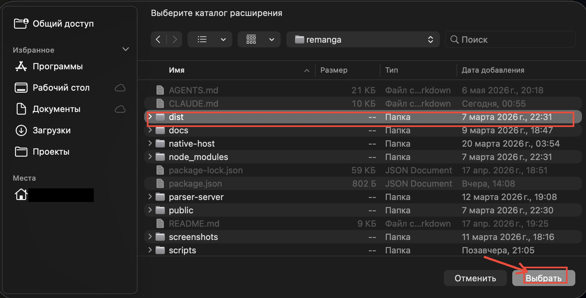
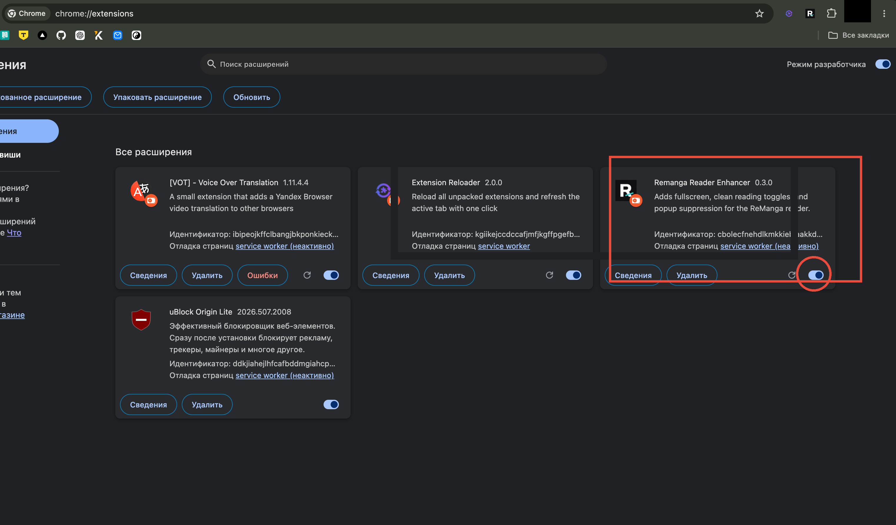
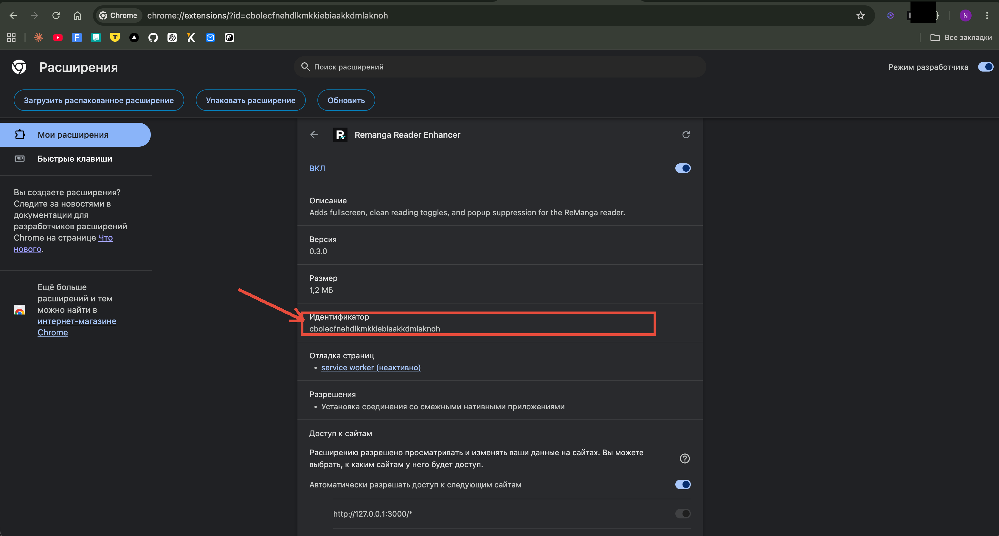

<p align="center">
  
</p>

<h1 align="center">ReManga Plus</h1>

<p align="center">
  Расширение для Chrome, которое <b>открывает платные главы remanga.org бесплатно</b> и убирает весь визуальный шум из читалки.
</p>

<p align="center">
  <a href="https://github.com/feechkablum6/remanga-plus/releases/latest"></a>
</p>

---

## Что ты получишь

- 🔓 **Premium Free** — читай платные главы бесплатно. Расширение само находит ту же главу в открытых источниках и подставляет в нативную читалку remanga.
- 🧹 **Чистый интерфейс** — убирает кнопки, баннеры, попапы и всё, что мешает читать.
- ⚙️ **Гибкие настройки** — сам решаешь, что скрыть, что оставить. Каждая кнопка — отдельный переключатель.
- 🚫 **Без всплывашек** — промо, подарки, тосты автоматически закрываются.

---

## 🔓 Premium Free — главная фича

Платная глава **без расширения** — нужно купить за монеты:

<p align="center">
  
</p>

**С расширением** — та же глава открывается сразу, бесплатно:

<p align="center">
  
</p>

> Premium Free пока работает только на **macOS** — для Windows и Linux в планах. Чистка интерфейса работает на всех системах.

---

## 🧹 Чистая читалка

Родная правая панель забита кнопками — расширение оставляет только нужные:

<table>
  <tr>
    <td align="center"><b>До</b></td>
    <td align="center"><b>После</b></td>
  </tr>
  <tr>
    <td></td>
    <td></td>
  </tr>
</table>

Каждая кнопка управляется отдельно — оставь то, чем реально пользуешься.

---

## 📥 Установка (5 минут)

### Шаг 1. Скачай ZIP

Перейди на [страницу релизов](https://github.com/feechkablum6/remanga-plus/releases/latest) и скачай файл **`remanga-plus.zip`**.

Распакуй архив куда угодно (например, в `Документы/remanga-plus/`). Внутри будет папка **`dist`** — она нам нужна.

### Шаг 2. Открой страницу расширений Chrome

В адресной строке введи:

```
chrome://extensions
```

В правом верхнем углу включи **«Режим разработчика»**.

<p align="center">
  
</p>

### Шаг 3. Загрузи папку `dist`

Нажми **«Загрузить распакованное расширение»** (слева вверху).
Откроется окно выбора папки — выбери **`dist`** из распакованного архива и нажми **«Выбрать»**.

<p align="center">
  
</p>

### Шаг 4. Готово

Расширение появится в списке. Тумблер должен быть включён (синий).

<p align="center">
  
</p>

Открывай **remanga.org** — расширение уже работает. Иконка в тулбаре Chrome покажет статус.

---

## ⚙️ Настройки

Все настройки — в двух местах:

### 1. Drawer на странице читалки

Открой любую главу, кликни на шестерёнку справа — увидишь раздел **«Дополнительные настройки»**:

<p align="center">
  
</p>

Здесь включаешь Premium Free, скрываешь панели, меню, комментарии, попапы и т.д.

### 2. Popup иконки в тулбаре

Кликни на иконку расширения в тулбаре Chrome — откроется popup с настройками шапки сайта и статусом Premium Free:

<p align="center">
  
</p>

---

## 🔓 Подключение Premium Free (только macOS)

Чтобы заработали бесплатные платные главы, нужно один раз установить вспомогательный компонент. Это требует одного шага в Терминале — не пугайся, всё по копипасте.

### Шаг 1. Узнай ID расширения

На странице `chrome://extensions` найди **Remanga Reader Enhancer** и нажми **«Сведения»**.
Прокрути до поля **«Идентификатор»** — это длинная строка букв. Скопируй её.

<p align="center">
  
</p>

### Шаг 2. Запусти команду в Терминале

Открой **Терминал** (через Spotlight: `Cmd + Space` → набери `Терминал`) и вставь:

```bash
cd ~/Документы/remanga-plus  # путь к распакованному архиву
npm install
npm run native:install -- --extension-id ВСТАВЬ_СЮДА_ID
```

Замени `ВСТАВЬ_СЮДА_ID` на скопированный идентификатор.

> Если в системе нет `npm` — поставь [Node.js](https://nodejs.org/ru) (LTS-версия), это разовая установка.

### Шаг 3. Включи Premium Free

Зайди на remanga.org, открой drawer настроек читалки → раздел **«Дополнительные настройки»** → переключатель **«Premium Free»**.

Открой любую платную главу — должна загрузиться без оплаты.

В popup иконки расширения статус сменится на **«Parser-server работает»** — значит всё подключилось.

---

## 💡 Совет

Для лучшего опыта используй вместе с [uBlock Origin Lite](https://chromewebstore.google.com/detail/ublock-origin-lite/ddkjiahejlhfcafbddmgiahcphecmpfh) — он уберёт рекламу, а ReManga Plus сделает сам интерфейс читалки идеально чистым.

---

## ❓ Частые вопросы

**Premium Free не работает, что делать?**
1. Проверь, что иконка расширения показывает **«Parser-server работает»**.
2. Если статус «остановлен» — нажми кнопку **«Перезапустить parser-server»** в popup.
3. Если по-прежнему не работает — переустанови Native Host командой из шага 2 выше.

**Можно ли использовать на Windows/Linux?**
Чистка интерфейса работает везде. Premium Free пока только macOS — поддержка других систем в планах.

**Это безопасно?**
Расширение полностью с открытым исходным кодом — можешь посмотреть сам. Никаких данных никуда не отправляется, никаких аккаунтов и токенов не запрашивается.

**Почему расширения нет в Chrome Web Store?**
Премиум-фича вряд ли пройдёт ревью Google, поэтому пока только установка вручную.

---

## Для разработчиков

Полная документация по архитектуре, конвенциям и сборке — в [AGENTS.md](AGENTS.md) и [CLAUDE.md](CLAUDE.md). Команды:

```bash
npm install
npm run build       # собрать расширение
npm run check       # проверка типов
npm run dev         # watch-режим
```

Backend (parser-server): отдельный пакет в `parser-server/`.

## Лицензия

MIT
