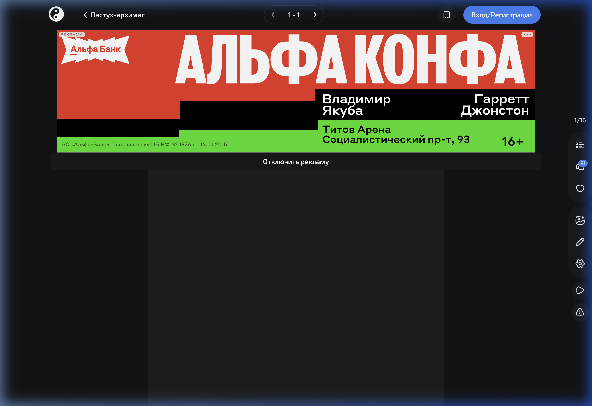
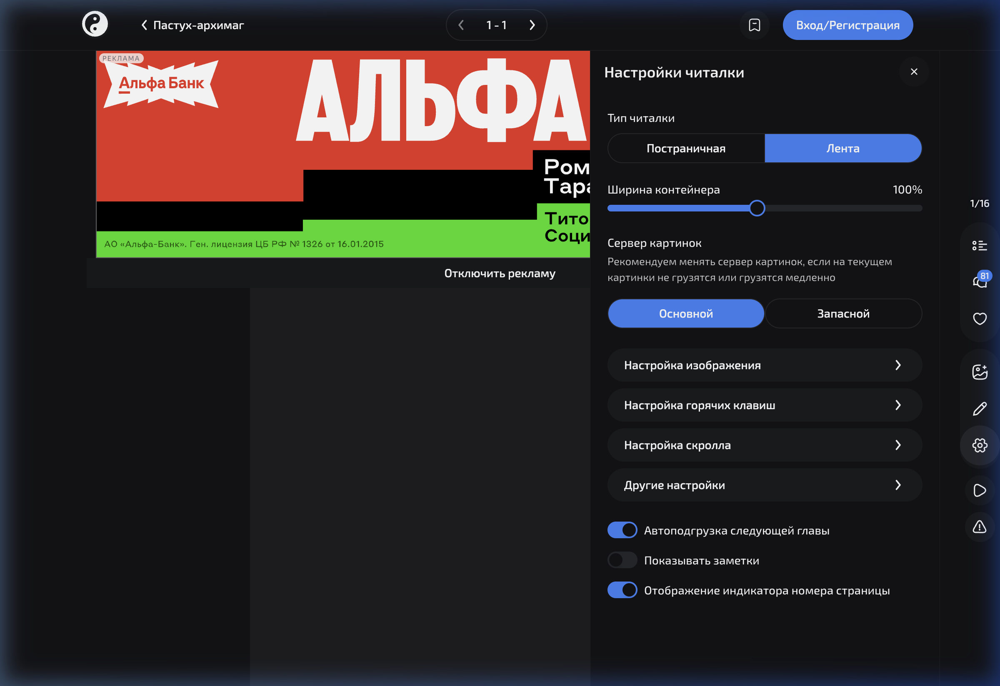

<p align="center">
  
</p>

<h1 align="center">ReManga Plus</h1>

<p align="center">
  Chrome-расширение, которое убирает визуальный шум из читалки <a href="https://remanga.org">ReManga</a> и даёт полный контроль над интерфейсом.
</p>

<p align="center">
  
  
  
</p>

---

## Что делает

ReManga Plus встраивается в страницу читалки и добавляет собственную панель настроек прямо в родной drawer. Все изменения применяются мгновенно и сохраняются между сессиями.

### Управление интерфейсом

| Функция | Описание |
|---------|----------|
| **Полноэкранный режим** | Кнопка fullscreen прямо на правой панели читалки |
| **Скрытие header** | Убирает верхнюю навигационную панель при чтении |
| **Скрытие правой панели** | Гибкое скрытие кнопок боковой панели — каждая кнопка управляется отдельным переключателем |
| **Скрытие счётчика страниц** | Убирает индикатор текущей страницы |
| **Скрытие комментариев** | Убирает блок комментариев под главой |
| **Минимизация настроек** | Сворачивает кнопку настроек в едва заметную полоску у правого края — наведение раскрывает её обратно |

### Кнопки правой панели

Расширение даёт отдельный переключатель для каждой кнопки:

- Список глав
- Комментарии
- Лайк
- Добавить изображение
- Редактирование
- Автоскролл
- Жалоба

### Улучшение меню настроек

Пресет **«Улучшить меню настроек»** позволяет скрыть лишние пункты из нативного drawer:

- Настройка изображения
- Настройка горячих клавиш
- Настройка скролла
- Другие настройки
- Тип читалки
- Индикатор номера страницы
- Показывать заметки

### Авто-скрытие попапов

| Категория | Что скрывает |
|-----------|-------------|
| **Подсказки** | Toast-уведомления и подсказки |
| **Подарки и промо** | Всплывающие окна наград, подарков, промо-акций (включая dialog-модалки) |
| **Прочие неблокирующие** | Остальные уведомления, которые не требуют действия |

---

## Скриншоты

<table>
  <tr>
    <td align="center"><b>Стандартная читалка</b></td>
    <td align="center"><b>Нативные настройки</b></td>
  </tr>
  <tr>
    <td></td>
    <td></td>
  </tr>
</table>

---

## Установка

### Из исходников

```bash
git clone https://github.com/feechkablum6/remanga-plus.git
cd remanga-plus
npm install
npm run build
```

### Загрузка в Chrome

1. Открой `chrome://extensions`
2. Включи **Developer mode** (переключатель в правом верхнем углу)
3. Нажми **Load unpacked**
4. Выбери папку `dist/`

Расширение автоматически активируется на страницах `remanga.org`.

---

## Разработка

```bash
# Проверка типов
npm run check

# Сборка
npm run build

# Сборка с авто-пересборкой при изменениях
npm run dev
```

### Структура проекта

```
src/
├── content.ts                  # Точка входа, наблюдатели DOM и маршрутов
├── reader-enhancer.ts          # Основная логика UI-мутаций
├── settings.ts                 # Контракт chrome.storage.sync
├── settings-menu-items.ts      # Описание пунктов нативного меню
├── settings-panel-transition.ts # Обработка переходов панели настроек
├── popup-dismissal.ts          # Селекторы и эвристики для автозакрытия попапов
└── rail-overlay-state.ts       # Состояние оверлея правой панели

tests/                          # Юнит-тесты
public/
└── manifest.json               # MV3 манифест расширения
```

---

## Технологии

- **TypeScript** (strict mode)
- **Vite** — сборка в IIFE бандл
- **Chrome Extension Manifest V3**
- **chrome.storage.sync** — синхронизация настроек между устройствами

## Лицензия

MIT
