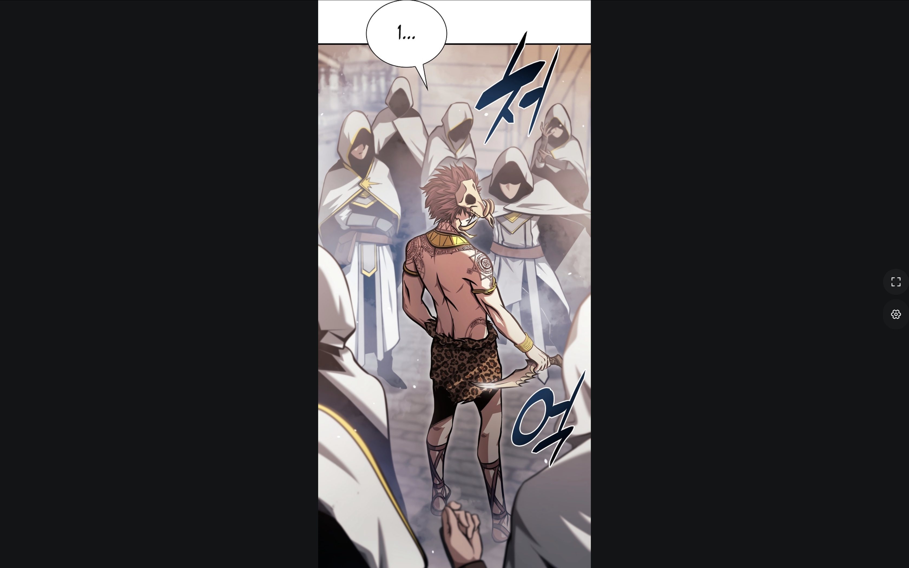
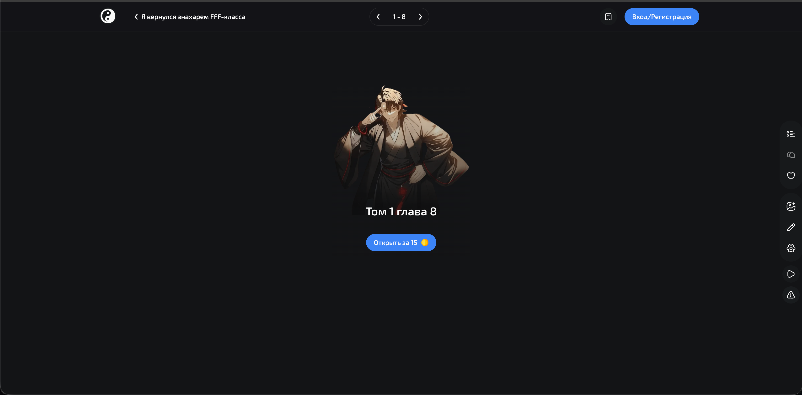
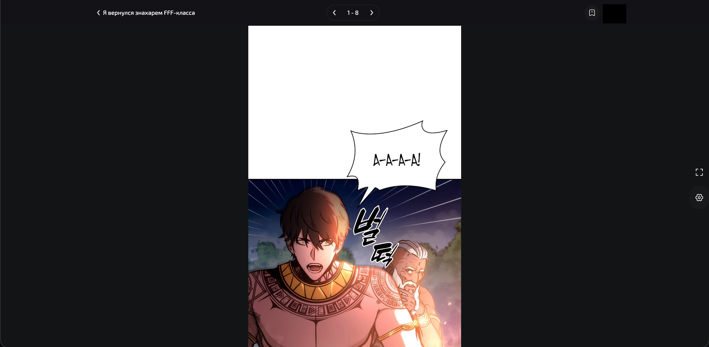
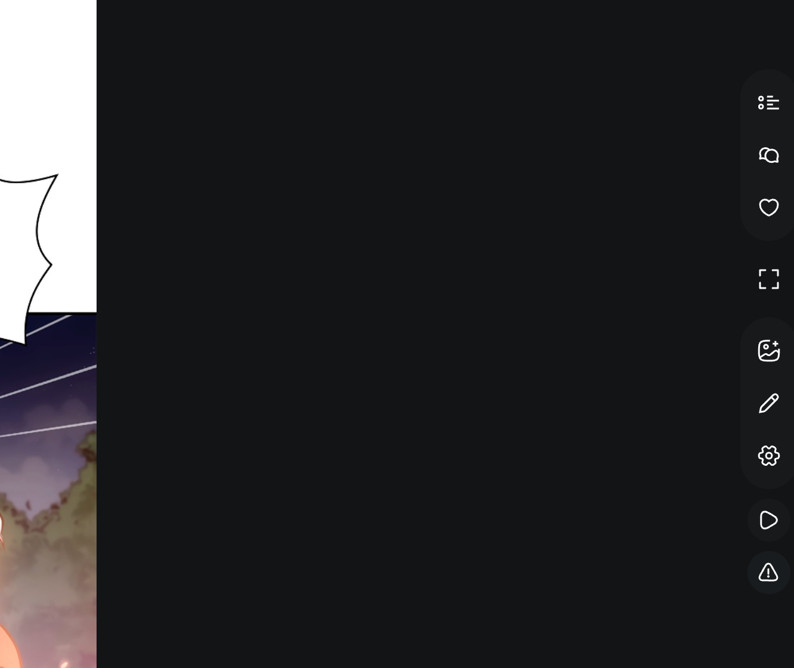
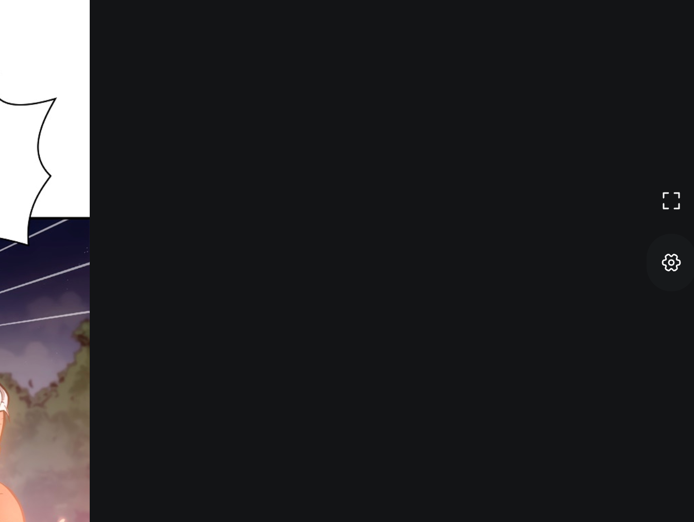
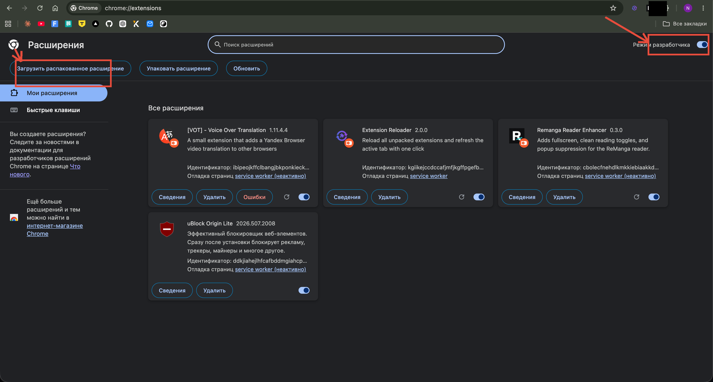
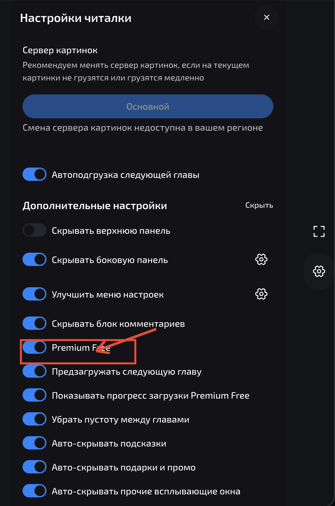
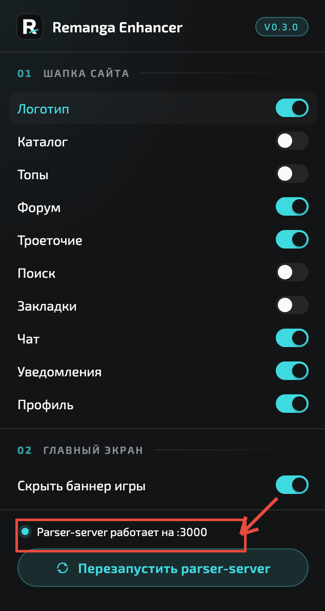

<p align="center">
  
</p>

<h1 align="center">ReManga Plus</h1>

<p align="center">
  Расширение для Chrome, которое <b>открывает платные главы remanga.org бесплатно</b> и убирает весь визуальный шум из читалки.
</p>

<p align="center">
  <a href="https://github.com/feechkablum6/remanga-plus/releases/latest"></a>
</p>

---

## Что ты получишь

- 🔓 **Premium Free** — читай платные главы бесплатно. Расширение само находит ту же главу в открытых источниках и подставляет в нативную читалку remanga.
- 🧹 **Чистый интерфейс** — убирает кнопки, баннеры, попапы и всё, что мешает читать.
- ⚙️ **Гибкие настройки** — сам решаешь, что скрыть, что оставить. Каждая кнопка — отдельный переключатель.
- 🚫 **Без всплывашек** — промо, подарки, тосты автоматически закрываются.

---

## 🔓 Premium Free — главная фича

Платная глава **без расширения** — нужно купить за монеты:

<p align="center">
  
</p>

**С расширением** — та же глава открывается сразу, бесплатно:

<p align="center">
  
</p>

> Premium Free работает на **macOS** и **Windows** (через одноимённые установщики ниже). Чистка интерфейса — на всех системах.

---

## 🧹 Чистая читалка

Родная правая панель забита кнопками — расширение оставляет только нужные:

<table>
  <tr>
    <td align="center"><b>До</b></td>
    <td align="center"><b>После</b></td>
  </tr>
  <tr>
    <td></td>
    <td></td>
  </tr>
</table>

Каждая кнопка управляется отдельно — оставь то, чем реально пользуешься.

---

## 📥 Установка (3 шага, ~2 минуты)

> Только для Mac на чипах M1/M2/M3/M4 (Apple Silicon). Версия для Intel-маков и Windows — позже.

### Шаг 1. Скачай и установи `.pkg`

На [странице релизов](https://github.com/feechkablum6/remanga-plus/releases/latest) скачай файл **`Remanga-Plus.pkg`**.

Дважды кликни по нему. Mac покажет окошко **«Не удалось открыть, разработчик не подтверждён»** — это нормально для бесплатного софта вне App Store. Закрой окошко, потом **правый клик** по `.pkg` → **«Открыть»** → ещё раз **«Открыть»**. Дальше как обычный установщик: **«Продолжить» → «Установить» → ввести пароль mac**.

После установки в Finder в **Программы** появится папка **«Remanga Plus»** — там лежат parser, Node и сама папка с расширением. Ничего удалять не надо.

### Шаг 2. Перетащи папку расширения в Chrome

Открой в адресной строке `chrome://extensions`, включи **«Режим разработчика»** в правом верхнем углу.

Открой Finder → **Программы** → **Remanga Plus** и просто **перетащи папку `extension`** в окно Chrome с расширениями.

<p align="center">
  
</p>

### Шаг 3. Открывай remanga.org

Расширение и parser-server уже подключены друг к другу автоматически. Premium Free, чистый интерфейс — всё работает.

Иконка в тулбаре Chrome показывает статус: должно быть **«Parser-server работает»**.

---

## 📥 Установка на Windows

1. Скачайте `Remanga-Plus-Setup.exe` из последнего релиза в [Releases](https://github.com/feechkablum6/remanga-plus/releases/latest) (~25 МБ).

2. Двойной клик. Windows покажет **«Windows protected your PC»** — это нормально, расширение без платной подписи Microsoft.

3. Жмите мелкий текст **«More info»** → появится кнопка **«Run anyway»** — жмите её.

4. Откроется мастер установки. Жмите **«Next»** → **«Install»** → **«Finish»**. Установится в `C:\Users\<имя>\AppData\Local\Programs\Remanga Plus` без запроса админских прав.

5. Откройте Chrome (или Edge / Brave / любой Chromium-браузер).

6. Перейдите в `chrome://extensions`, включите тумблер **«Режим разработчика»** в правом верхнем углу.

7. Нажмите **«Загрузить распакованное»** и выберите папку: `C:\Users\<имя>\AppData\Local\Programs\Remanga Plus\extension`

8. Откройте [remanga.org](https://remanga.org) — расширение работает.

### Удаление

**Параметры** → **Приложения** → **Установленные приложения**, найдите **«Remanga Plus»**, нажмите **«Удалить»**. Уберёт все файлы, ключи реестра и кеш. Расширение из Chrome удалите отдельно через `chrome://extensions`.

---

## ⚙️ Настройки

Все настройки — в двух местах:

### 1. Drawer на странице читалки

Открой любую главу, кликни на шестерёнку справа — увидишь раздел **«Дополнительные настройки»**:

<p align="center">
  
</p>

Здесь включаешь Premium Free, скрываешь панели, меню, комментарии, попапы и т.д.

### 2. Popup иконки в тулбаре

Кликни на иконку расширения в тулбаре Chrome — откроется дашборд из трёх категорий:

- **Сайт** — что скрывать на самом сайте (кнопки шапки, баннер игры на главной, фильтр закладок).
- **Читалка** — настройки внутри читалки: скрыть шапку, правую панель, счётчик страниц, комментарии, плотный фид глав.
- **Premium Free** — главный тоггл бесплатного доступа к платным главам + префетч следующей главы.

Тап по карточке открывает подэкран с её переключателями (`‹ Назад` возвращает на главный экран).

Снизу — компактный блок **«Сервис»**: статус parser-server (если работает — просто текст с бирюзовым кружком; если упал — рядом появляется иконка-перезагрузка), и строка импорта закладок MangaLib → Remanga с кликабельными именами сайтов (открывают сами сайты в новой вкладке для логина) и пилюлей **«Импорт →»**.

<p align="center">
  
</p>

> Скриншот выше может отставать от текущей версии — в v0.6.0 попап переработан в дашборд (см. описание выше). Чтобы увидеть актуальный вид, открой иконку расширения после обновления.

---

## 💡 Совет

Для лучшего опыта используй вместе с [uBlock Origin Lite](https://chromewebstore.google.com/detail/ublock-origin-lite/ddkjiahejlhfcafbddmgiahcphecmpfh) — он уберёт рекламу, а ReManga Plus сделает сам интерфейс читалки идеально чистым.

---

## ❓ Частые вопросы

**Premium Free не работает, что делать?**
1. Открой popup расширения и посмотри блок **«Сервис»**.
2. Если видишь «**Parser-server не запущен**» с красным кружком — рядом появится иконка-перезагрузка (круговая стрелка) справа. Жми её, иконка покрутится и сервер должен подняться.
3. Если «**Parser-server :3000**» с бирюзовым кружком — сервер работает, и иконки-перезагрузки не будет видно (это норма).
4. Если ничего не помогает — переустанови `Remanga-Plus.pkg` (двойной клик ещё раз).

**Как удалить?**
Удали папку **«Remanga Plus»** из `Программы` в Finder и файлы `org.remanga.parser_host.json` из `~/Library/Application Support/Google/Chrome/NativeMessagingHosts/` (и аналогичных папок других Chromium-браузеров, если они установлены).

**Можно ли использовать на Windows/Linux?**
Чистка интерфейса работает везде. Premium Free — на macOS и Windows (см. установщики выше). Linux пока в планах.

**Это безопасно?**
Расширение полностью с открытым исходным кодом — можешь посмотреть сам. Никаких данных никуда не отправляется, никаких аккаунтов и токенов не запрашивается.

**Почему расширения нет в Chrome Web Store?**
Премиум-фича вряд ли пройдёт ревью Google, поэтому пока только установка вручную.

---

## Для разработчиков

Полная документация по архитектуре, конвенциям и сборке — в [AGENTS.md](AGENTS.md) и [CLAUDE.md](CLAUDE.md). Команды:

```bash
npm install
npm run build       # собрать расширение
npm run check       # проверка типов
npm run dev         # watch-режим
```

Backend (parser-server): отдельный пакет в `parser-server/`.

## Лицензия

MIT
