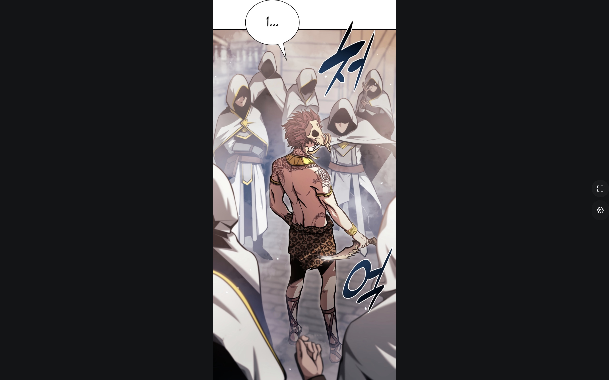

# ReManga Plus



Расширение для Chromium-браузеров, которое приводит в порядок читалку remanga.org: убирает лишние элементы интерфейса, добавляет гибкие настройки и режим Premium Free с подгрузкой глав из открытых источников через локальный parser-server.

## Возможности

- **Чистый интерфейс** — можно скрыть шапку, правую панель, комментарии, баннеры, промо, подсказки и всплывающие окна. Каждый элемент управляется отдельным переключателем.
- **Premium Free** — расширение ищет главу в открытых источниках (Mangabuff, Senkuro, InkStory, Telemanga, Teletype, Usagi, WaManga) и подставляет страницы в читалку, подгружая следующие главы по мере чтения. Провайдеров можно включать и выключать в popup.
- **Навигация** — счётчик страниц, заголовок главы, кнопки назад/вперёд и отметка «просмотрено» синхронизируются с лентой.
- **Гибкие настройки** — отдельные переключатели для кнопок шапки, элементов читалки, фильтра закладок и провайдеров Premium Free.
- **Импорт закладок** — перенос MangaLib в Remanga через отдельную страницу импорта с сохранением категорий и прогресса.
- **Локальный parser-server** — ставится вместе с расширением и запускается автоматически через Native Messaging.

## Установка на macOS

Поддерживаются Mac на Apple Silicon (M1–M4). Для Intel Mac готового установщика нет.

1. На [странице релизов](https://github.com/feechkablum6/remanga-plus/releases/latest) скачай `Remanga-Plus.pkg`. Если macOS покажет «разработчик не подтверждён», сделай правый клик по `.pkg` → «Открыть» → ещё раз «Открыть», дальше «Продолжить» → «Установить».
2. После установки в **Программах** появится папка **Remanga Plus**. Открой `chrome://extensions`, включи **«Режим разработчика»** и перетащи туда папку `/Applications/Remanga Plus/extension`.
3. Открой [remanga.org](https://remanga.org). Расширение и parser-server подключаются автоматически; в popup статус должен быть **«Parser-server работает»**.

## Установка на Windows

1. Скачай `Remanga-Plus-Setup.exe` из последнего [релиза](https://github.com/feechkablum6/remanga-plus/releases/latest).
2. Запусти установщик. Если появится **«Windows protected your PC»**, нажми **«More info»** → **«Run anyway»**.
3. Пройди мастер: **Next** → **Install** → **Finish**. Установка идёт в `%LOCALAPPDATA%\Programs\Remanga Plus` без прав администратора.
4. В конце установщик откроет папку `extension` и страницу расширений в Chrome или Edge. Включи **«Режим разработчика»**, нажми **«Загрузить распакованное»** и выбери папку `extension`.
5. Открой [remanga.org](https://remanga.org). Parser-server запустится автоматически через Native Messaging.

Удаление: **Параметры** → **Приложения** → **Установленные приложения** → **Remanga Plus** → «Удалить». Расширение из браузера убирается отдельно через `chrome://extensions`.

## Использование

- **Настройки читалки** — открой любую главу, нажми шестерёнку справа и найди раздел **«Дополнительные настройки»**.
- **Popup расширения** — клик по иконке открывает dashboard с разделами **Сайт**, **Читалка** и **Premium Free**, а снизу блок **«Сервис»** со статусом parser-server, кнопкой перезапуска и авторизацией MangaLib/Remanga для импорта закладок.
- **Импорт закладок** — когда MangaLib и Remanga авторизованы, кнопка **«Импорт →»** открывает страницу переноса.

Совет: используй вместе с [uBlock Origin Lite](https://chromewebstore.google.com/detail/ublock-origin-lite/ddkjiahejlhfcafbddmgiahcphecmpfh) — он убирает рекламу, а ReManga Plus чистит сам интерфейс сайта и читалки.

## Для разработчиков

```bash
npm install
npm run build       # собрать extension bundles в dist/
npm run check       # проверка типов: extension + native host
npm run dev         # watch только для content script
```

Parser-server — отдельный пакет:

```bash
cd parser-server
npm install
npm run dev
npm run check
npm test
```

Установщики:

```bash
npm run pkg:build          # macOS Apple Silicon .pkg
npm run pkg:windows        # Windows x64 .exe
```

Подробная архитектура и ограничения описаны в [CLAUDE.md](CLAUDE.md).

## Технологии

TypeScript (strict), Vite (IIFE-бандлы), Manifest V3, ванильный DOM без фреймворков, Native Messaging, Fastify (parser-server), Node.js. Установщики: pkgbuild/productbuild для macOS, NSIS для Windows.

## Лицензия

MIT

---

**Автор:** AkashiDevelop (Никита) — веб-разработчик: сайты, Telegram-боты, автоматизация, браузерные расширения, десктоп-приложения.

[Telegram](https://t.me/akashidevelpr) · [Kwork](https://kwork.ru/user/akashidevelop) · [GitHub](https://github.com/feechkablum6)
